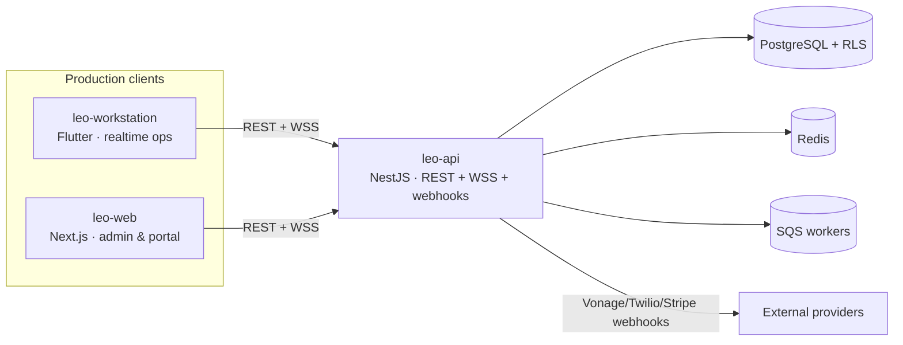
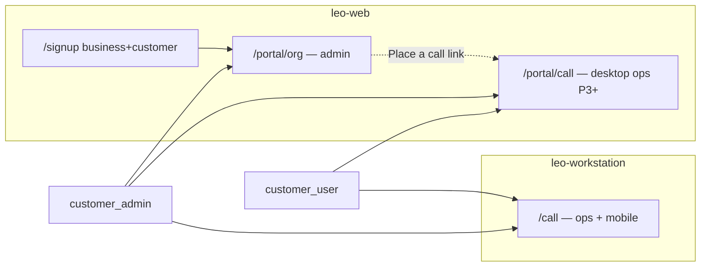
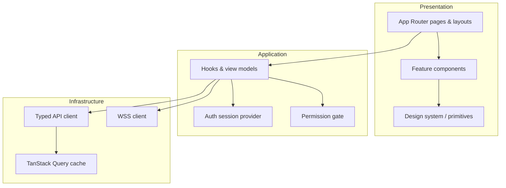
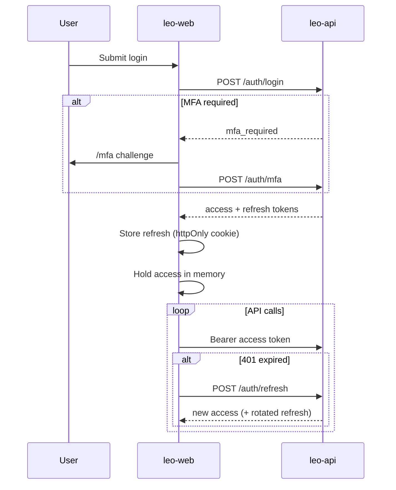
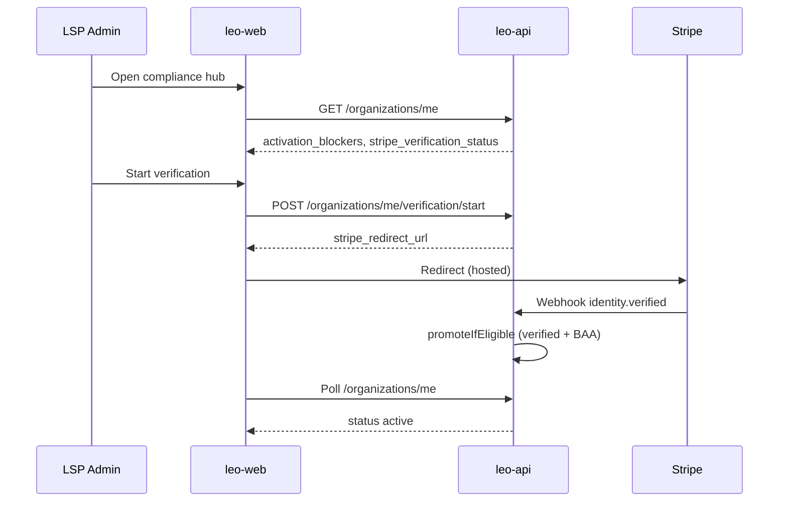
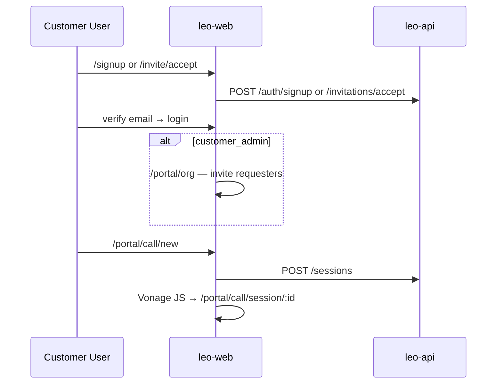

# leo-web — Architecture Overview

*Target architecture — v1.1. Synced from* `[docs/ARCHITECTURE.md](../docs/ARCHITECTURE.md)`*; edit the canonical file first, then re-sync here.*

> **Scope.** Standalone spec for `leo-web`: what it is, how it is built, and everything to implement across P1–P8. Backend contracts live in the sibling `[leo-api](../leo-api)` repo; primary realtime ops live in `[leo-workstation](../leo-workstation)` (Flutter).
>
> **Platform docs (read-only from here):** product rules → `[../leo-api/docs/product-spec.md](../leo-api/docs/product-spec.md)`; full UI screen inventory → `[../leo-api/docs/architecture-reference.md](../leo-api/docs/architecture-reference.md)`.
>
> **v1.1:** Customer **business accounts** are web-first (signup → org admin → **desktop call portal** at P3). Interpreter and dispatch remain workstation-only. See [§3.4](#34-customer-accounts--call-portal-bd7-refinement).

---


## Table of contents

1. [Executive summary](#1-executive-summary)
2. [Platform context](#2-platform-context)
3. [Scope boundaries](#3-scope-boundaries)
  - [3.4 Customer accounts & call portal](#34-customer-accounts--call-portal-bd7-refinement)
4. [Technology stack](#4-technology-stack)
5. [Application architecture](#5-application-architecture)
6. [A1, uthentication & tenancy](#6-authentication--tenancy)
7. [Route map & role surfaces](#7-route-map--role-surfaces)
8. [Feature domains](#8-feature-domains)
9. [API integration](#9-api-integration)
10. [Realtime & notifications](#10-realtime--notifications)
11. [Payments & Stripe](#11-payments--stripe)
12. [Design system & accessibility](#12-design-system--accessibility)
13. [Security & compliance](#13-security--compliance)
14. [Cross-app integration](#14-cross-app-integration)
15. [Repository structure](#15-repository-structure)
16. [Phase roadmap](#16-phase-roadmap)
17. [Implementation checklist](#17-implementation-checklist)
18. [Non-goals](#18-non-goals)
19. [Related documentation](#19-related-documentation)
20. [Implementation status (as-built)](#20-implementation-status-as-built-2026-07-07)

---


## 1. Executive summary

**Leo Web (**`leo-web`**)** is the **Next.js / React** production client for **organization administration, customer portals, compliance, billing, reporting, onboarding, and (from P3) desktop customer call flows**. It serves four primary audiences:


| Audience               | Primary surface              | Role slug        | Notes                                                   |
| ---------------------- | ---------------------------- | ---------------- | ------------------------------------------------------- |
| **Platform operator**  | Global platform admin        | `platform_admin` | Break-glass; CLI bootstrap                              |
| **LSP back-office**    | LSP admin dashboard          | `lsp_admin`      | Dispatch stays in workstation                           |
| **Customer org admin** | Customer portal — org        | `customer_admin` | **Web home** for business account management            |
| **Customer requester** | Customer portal — call (P3+) | `customer_user`  | **Desktop browser** call path; mobile stays workstation |


Leo Web does **not** host interpreter accept, dispatch boards, or interpreter presence — those belong exclusively to `leo-workstation` (Flutter). From **P3 (**`v0.1.0`**)**, Leo Web adds a **customer call portal** (`/portal/call/`*) using Vonage/Twilio **JS SDKs** for desktop browser-only orgs (hospitals, clinics). **Customer mobile** (smartphone) remains `leo-workstation` **only** (v0.1.0+).

**Why a separate web app (BD7):** Admin workflows — data grids, CSV/XLSX export, rate-card matrices, onboarding wizards, Stripe-hosted flows, and compliance dashboards — are a poor fit for Flutter. Next.js also provides SEO for public signup, a **browser-only customer funnel** (signup → manage org → place calls without installing Flutter), embeddable Leo Text surfaces (P6), and mature table/filter/export UX.

**First meaningful delivery:** P2 scaffolding (auth, signup, org profile, user management, rate cards, billing records list). **Customer portal shell + desktop call path:** P3. **Full reporting UI:** P4 when `GET /reports/`* lands on the API.

---


## 2. Platform context




| Repo                  | Stack                             | Owns                                                                                                              |
| --------------------- | --------------------------------- | ----------------------------------------------------------------------------------------------------------------- |
| `**leo-api**`         | NestJS 11, Prisma, PostgreSQL+RLS | Sole writer to Postgres; REST `api/v1`, WSS `/realtime`, provider webhooks                                        |
| `**leo-workstation**` | Flutter, `go_router`              | Interpreter idle/in-session, dispatch portal; **primary** customer call flow (P2+ desktop/tablet; v0.1.0+ mobile) |
| `**leo-web**`         | Next.js, React                    | Signup, LSP admin, **customer org portal**, **desktop customer call portal (P3+)**, billing, reports, compliance  |


Wire format (all clients): **snake_case JSON**, money as **integer cents**, timestamps as **UTC ISO 8601** displayed in the user's timezone.

---


## 3. Scope boundaries


### 3.1 Leo Web owns

- Public and authenticated **signup / login / MFA / password recovery**
- **Organization profile** and post-signup **onboarding wizards** (LSP and customer)
- **User & invitation management** (create, invite, reset password, toggle active, delete)
- **Interpreter approval queues** (credential review, affiliation approve/reject)
- **Global catalog administration** (Platform Admin: languages, certifications, tiers)
- **Rate cards, billing records, adjustments, disputes**
- **Payments & Stripe** (verification CTA, Connect onboarding, payment methods)
- **Reporting & export** (KPI cards, filterable tables, CSV/XLSX)
- **Compliance hub** (Stripe verification status, BAA status, activation blockers)
- **Platform Admin** break-glass (tenant browser, audit, fee floor, catalog)
- **Customer business signup** (`business` + `customer` union variant)
- **Customer org portal** — org profile, members, invites, LSP links, billing-field config, org-scoped billing/reports
- **Customer desktop call portal (P3+)** — on-demand request, scheduled booking, My Requests, in-session customer UI (Vonage/Twilio JS SDK)
- **Customer own-scope reports (P4+)** — requester-visible history on web (org-wide remains Customer Admin only)
- **Leo Text** embed widget and customer portal chat (P6)
- **Subscription management** (P7)
- **DSR, legal holds, breach workflow** (P8)


### 3.2 Leo Web explicitly does not own


| Capability                                         | Owner                  | Notes                                                |
| -------------------------------------------------- | ---------------------- | ---------------------------------------------------- |
| On-demand **accept** (interpreter)                 | `leo-workstation`      | Desktop only                                         |
| Dispatch boards (unassigned, active, escalations)  | `leo-workstation`      | Sub-Admin has no web dashboard                       |
| Interpreter presence / status selector             | `leo-workstation`      |                                                      |
| **Customer mobile** call UI (smartphone)           | `leo-workstation`      | v0.1.0+; web call portal is **desktop browser only** |
| Guest join (`/join`)                               | `leo-workstation`      | Camera/mic guest surface                             |
| Sub-Admin dispatch-only role                       | `leo-workstation` only |                                                      |
| Interpreter mobile (read-only)                     | `leo-workstation`      |                                                      |
| Platform Admin manual KYB approval queue           | **Rejected**           | Stripe-hosted verification only                      |
| Session recording / playback UI                    | **Never**              | Explicit product exclusion                           |
| Raw card entry outside Stripe Elements / hosted UI | **Never**              |                                                      |


**Dual-path note:** Customer **call** flows exist on **both** clients from P3 — workstation remains the unified ops app (P2 MVP + mobile); web adds a **browser-only desktop path** so business customers never need Flutter for request → session on a hospital desktop.

### 3.3 Settings ownership split


| Layer                                                    | `leo-workstation`                             | `leo-web`                                       |
| -------------------------------------------------------- | --------------------------------------------- | ----------------------------------------------- |
| Personal (password shortcut, night mode, device prefs)   | Primary                                       | Full account security UI                        |
| Session ops (status, availability, in-session, dispatch) | Primary                                       | —                                               |
| Org / tenant admin                                       | **Link out only** (LSP + Customer Admin)      | **All** configuration, users, rates, billing    |
| Customer call (request, in-session)                      | **Primary** (P2+ all devices; mobile v0.1.0+) | **Desktop browser path** (P3+ `/portal/call/`*) |


### 3.4 Customer accounts & call portal (BD7 refinement)

Customer **business accounts** (`organizations.type = customer`) are a **web-first product**, not an afterthought on the LSP admin app. The split mirrors LSP Admin (hybrid ops + web back-office):




| Persona            | Web home                                            | Workstation                               | Rationale                                                        |
| ------------------ | --------------------------------------------------- | ----------------------------------------- | ---------------------------------------------------------------- |
| **Customer Admin** | `/portal/org` — members, billing, reports, settings | `/call` when personally placing a session | Admins manage the business on web; ops optional on either client |
| **Customer User**  | `/portal/call` (P3+, desktop)                       | `/call` (P2+ primary; mobile v0.1.0+)     | Browser-only hospitals use web; field/mobile uses Flutter        |


**Browser-only funnel (P3+):** signup → email verify → login → org setup (Admin) or invitation accept (User) → **place call in the same browser tab** — no Flutter install required on desktop.

**Login routing (no auto-redirect):**


| Role             | Default after login (web) | Workstation link                               |
| ---------------- | ------------------------- | ---------------------------------------------- |
| `customer_admin` | `/portal/org`             | Header / CTA → open workstation for mobile ops |
| `customer_user`  | `/portal/call` (P3+)      | Optional “Open in app” for mobile              |


**Permission highlights:**


| Action                      | `customer_user`                 | `customer_admin`  |
| --------------------------- | ------------------------------- | ----------------- |
| Org settings write          | ✗                               | web only          |
| Org-wide billing / reports  | ✗                               | web only          |
| Invite Customer Users       | ✗                               | web only          |
| Place / manage own sessions | web (desktop P3+) + workstation | web + workstation |
| Billing popup field config  | ✗                               | web only          |


Decision record: `[../leo-api/docs/decision-log.md](../leo-api/docs/decision-log.md)` **BD7a**.

## 4. Technology stack


| Layer                            | Choice                                                     | Rationale                                                              |
| -------------------------------- | ---------------------------------------------------------- | ---------------------------------------------------------------------- |
| **Framework**                    | Next.js 15+ (App Router)                                   | SSR/SSG for signup & marketing; API routes for BFF patterns if needed  |
| **Language**                     | TypeScript 5.x                                             | Matches `leo-api`                                                      |
| **UI**                           | React 19                                                   | Ecosystem maturity for data grids                                      |
| **Styling**                      | Tailwind CSS + design tokens                               | Align with workstation token palette (Syne, DM Sans, DM Mono)          |
| **Forms**                        | React Hook Form + Zod                                      | Client validation mirroring API DTOs                                   |
| **Data fetching**                | TanStack Query                                             | Cache, retry, optimistic updates for admin grids                       |
| **Tables**                       | TanStack Table                                             | Sort, filter, pagination for reports                                   |
| **Auth storage**                 | httpOnly secure cookies (refresh) + in-memory access token | INV-AUTH-1/D7 short-lived access tokens                                |
| **Realtime**                     | Native WebSocket client                                    | WSS `/realtime` for `notification.push`                                |
| **Payments UI**                  | Stripe.js + Connect embedded components                    | No raw PAN handling                                                    |
| **Media (customer desktop P3+)** | Vonage Video JS SDK + Twilio Voice JS SDK                  | Same provider contract as workstation; customer-facing in-session only |
| **Testing**                      | Vitest + Playwright                                        | Unit + critical-path e2e                                               |
| **Lint**                         | ESLint + Prettier                                          | Match monorepo conventions                                             |


**Deployment target:** Static/SSR on CDN + edge (Vercel or equivalent); environment-specific API base URL. HSTS + CSP enforced at edge (D6).

---


## 5. Application architecture


### 5.1 High-level layers




### 5.2 Layout strategy (App Router)


| Layout group               | Path prefix                                                                                        | Guard                                            |
| -------------------------- | -------------------------------------------------------------------------------------------------- | ------------------------------------------------ |
| **Public**                 | `/`, `/signup`, `/login`, `/forgot-password`, `/reset-password`, `/verify-email`, `/invite/accept` | None                                             |
| **Platform Admin**         | `/admin/platform/`*                                                                                | `platform_admin`                                 |
| **LSP Admin**              | `/admin/lsp/`*                                                                                     | `lsp_admin`                                      |
| **Customer Portal — org**  | `/portal/org/`*                                                                                    | `customer_admin`                                 |
| **Customer Portal — call** | `/portal/call/`*                                                                                   | `customer_admin`, `customer_user` (P3+, desktop) |
| **Shared authenticated**   | `/account/`*                                                                                       | Any authenticated user                           |


Each protected layout:

1. Validates session (access token or refresh flow).
2. Enforces MFA completion for privileged roles.
3. Renders **active tenant** label and **switch-tenant** modal when JWT carries multiple memberships.
4. Mounts **notification center** (WSS subscription).


### 5.3 Permission model

Authorization is **server-enforced** (`leo-api` RBAC); the web client mirrors the matrix for UX only (hide vs disable).

- Source of truth: `permission-matrix.ts` in `leo-api` — `../leo-api/src/modules/identity/constants/permission-matrix.ts`; generate or sync a client-side map at build time.
- **Default deny:** unknown routes redirect to permission-denied empty state.
- **403/404:** treat cross-tenant resources as 404 (INV-ERROR-1).

Privileged roles requiring MFA: `platform_admin`, `lsp_admin`, `sub_admin`.

---


## 6. Authentication & tenancy


### 6.1 Auth flows


| Flow                     | Endpoint(s)                                          | Notes                                                                       |
| ------------------------ | ---------------------------------------------------- | --------------------------------------------------------------------------- |
| Login                    | `POST /auth/login`                                   | Returns access + refresh; may require MFA step                              |
| MFA challenge            | `POST /auth/mfa`                                     | After login or privileged `switch-tenant`                                   |
| MFA enroll               | `POST /auth/mfa/enroll`                              | First privileged login / invitation accept                                  |
| Refresh                  | `POST /auth/refresh`                                 | Rotating refresh tokens (INV-AUTH-2)                                        |
| Logout                   | `POST /auth/logout`                                  | Revoke refresh family                                                       |
| Signup (union)           | `POST /auth/signup`                                  | Variants: `personal` (interpreter), `business`+`customer`, `business`+`lsp` |
| Email verify             | `POST /auth/verify-email`                            | Required before first login                                                 |
| Forgot / reset password  | `POST /auth/forgot-password`, `/auth/reset-password` |                                                                             |
| Accept invitation        | `POST /invitations/accept`                           | Sub-Admin, Customer User                                                    |
| Switch tenant            | `POST /auth/switch-tenant`                           | Re-mints JWT; MFA if entering privileged context                            |
| Platform Admin bootstrap | `POST /auth/reset-password`                          | One-time token from CLI (BD6) → `/admin/setup`                              |


### 6.2 JWT claims (client usage)


| Claim       | Usage                                                    |
| ----------- | -------------------------------------------------------- |
| `sub`       | Current user ID                                          |
| `tenant_id` | Active organization (absent for tenant-less interpreter) |
| `role`      | Active membership role slug                              |
| `exp`       | Access token expiry (≤15 min)                            |


**Login resolution:**

- **0 memberships** → tenant-less token (interpreter awaiting affiliation).
- **1+ memberships** → token scoped to most recent active membership.
- User may switch via modal calling `switch-tenant`.


### 6.3 Session handling




On **401** with expired access: silent refresh once; on failure → session-expired overlay → `/login`.

---


## 7. Route map & role surfaces


### 7.1 Public routes


| Route              | Phase | Purpose                                           |
| ------------------ | ----- | ------------------------------------------------- |
| `/signup`          | P1    | Union signup variant picker                       |
| `/signup/success`  | P1    | Email verification pending state                  |
| `/login`           | P1    | Shared login                                      |
| `/mfa`             | P1    | TOTP challenge                                    |
| `/mfa/enroll`      | P1    | TOTP setup                                        |
| `/verify-email`    | P1    | Email verification handler                        |
| `/forgot-password` | P1    | Request reset link                                |
| `/reset-password`  | P1    | Set new password (incl. Platform Admin bootstrap) |
| `/invite/accept`   | P1    | Invitation acceptance                             |
| `/admin/setup`     | P1    | Platform Admin first-login after CLI bootstrap    |


### 7.2 LSP Admin — `/admin/lsp/*`


| Route                                | Phase | Feature                                              |
| ------------------------------------ | ----- | ---------------------------------------------------- |
| `/admin/lsp`                         | P2    | Dashboard / home redirect                            |
| `/admin/lsp/onboarding`              | P2    | Post-signup wizard (partners, languages, pricing)    |
| `/admin/lsp/users`                   | P1    | User list + invite modal                             |
| `/admin/lsp/users/:id`               | P1    | User detail (reset, toggle, delete, role promotion)  |
| `/admin/lsp/interpreters`            | P2    | Interpreter list (pending/active filters)            |
| `/admin/lsp/interpreters/:id`        | P2    | Detail: languages, certs, proof review, affiliations |
| `/admin/lsp/billing/rates`           | P2    | Rate card matrix                                     |
| `/admin/lsp/billing/records`         | P2    | Billing records list                                 |
| `/admin/lsp/billing/records/:id`     | P2    | Immutable record detail + line items                 |
| `/admin/lsp/billing/adjustments`     | P4    | Dispute → append-only adjustment                     |
| `/admin/lsp/compliance`              | P4    | Activation hub (Stripe + BAA blockers)               |
| `/admin/lsp/partners`                | P5    | Partner LSP ranking + BAA status                     |
| `/admin/lsp/payouts/connect`         | P4    | Stripe Connect onboarding                            |
| `/admin/lsp/payouts`                 | P4    | Payout list                                          |
| `/admin/lsp/schedule`                | P3    | Scheduled calendar (read/manage)                     |
| `/admin/lsp/reports`                 | P4    | KPI + export catalog                                 |
| `/admin/lsp/settings/profile`        | P1    | Org profile                                          |
| `/admin/lsp/settings/certifications` | P2    | LSP-recognized cert picker                           |
| `/admin/lsp/subscription`            | P7    | Seat-tier plan management                            |


### 7.3 Customer Portal — org admin (`/portal/org/*`)


| Route                          | Phase | Role                              | Feature                               |
| ------------------------------ | ----- | --------------------------------- | ------------------------------------- |
| `/portal/org`                  | P3    | `customer_admin`                  | Portal home / dashboard               |
| `/portal/org/settings`         | P1    | `customer_admin`                  | Org profile, registered address       |
| `/portal/org/members`          | P1    | `customer_admin`                  | Members + invites                     |
| `/portal/org/lsp-links`        | P3    | `customer_admin`                  | Linked LSPs + cascade config          |
| `/portal/org/billing-fields`   | P2    | `customer_admin`                  | In-session billing popup field config |
| `/portal/org/billing/records`  | P2    | `customer_admin`                  | Org-scoped billing records            |
| `/portal/org/billing/payment`  | P4    | `customer_admin`                  | Payment method (Stripe Elements)      |
| `/portal/org/billing/invoices` | P4    | `customer_admin`                  | Monthly invoice summary               |
| `/portal/org/reports`          | P4    | `customer_admin`                  | Org-scoped reports + export           |
| `/portal/leo`                  | P6    | `customer_admin`, `customer_user` | Org-branded Leo Text chat             |


### 7.4 Customer Portal — call ops (`/portal/call/*`) `[P3+, desktop]`


| Route                       | Phase | Role                              | Feature                                     |
| --------------------------- | ----- | --------------------------------- | ------------------------------------------- |
| `/portal/call`              | P3    | `customer_admin`, `customer_user` | Call hub (Ask Leo link, new request CTA)    |
| `/portal/call/new`          | P3    | both                              | On-demand request wizard → `POST /sessions` |
| `/portal/call/schedule`     | P3    | both                              | Scheduled booking                           |
| `/portal/call/requests`     | P3    | both                              | My Requests — status chips, filters         |
| `/portal/call/requests/:id` | P3    | both                              | Request detail, access code share (P3)      |
| `/portal/call/session/:id`  | P3    | both                              | In-session customer UI (Vonage/Twilio JS)   |
| `/portal/call/reports`      | P4    | `customer_user` (own scope)       | Own utilization summary + export            |


**Device guard:** Show `/portal/call/`* on **desktop/tablet browsers** only; viewport below phone breakpoint shows “Open Leo Workstation” / store link (mobile ops stay Flutter).

**Parity with workstation:** Same API and WSS events as `leo-workstation` `/call/`*; UI may differ but state machine and permissions must match `[../leo-api/docs/architecture-reference.md](../leo-api/docs/architecture-reference.md)` §G.

### 7.5 Platform Admin — `/admin/platform/*`


| Route                                    | Phase | Feature                                     |
| ---------------------------------------- | ----- | ------------------------------------------- |
| `/admin/platform`                        | P1    | Global ops dashboard                        |
| `/admin/platform/tenants`                | P1    | Tenant browser + break-glass force-status   |
| `/admin/platform/tenants/:id`            | P2    | Tenant detail; manual platform BAA (P2 ops) |
| `/admin/platform/catalog/languages`      | P1    | Language CRUD (`is_signed` badge)           |
| `/admin/platform/catalog/certifications` | P1    | Certification CRUD                          |
| `/admin/platform/catalog/tiers`          | P1    | Language tier CRUD                          |
| `/admin/platform/billing/floor`          | P2    | Platform fee floor                          |
| `/admin/platform/audit`                  | P1    | Audit log viewer                            |
| `/admin/platform/audit/ai`               | P6    | AI interaction audit                        |
| `/admin/platform/grants`                 | P5    | Overflow grant audit (read-only)            |
| `/admin/platform/break-glass`            | P8    | Break-glass action log                      |
| `/admin/compliance/dsr`                  | P8    | Data subject requests                       |
| `/admin/compliance/incidents`            | P8    | Security incidents                          |
| `/admin/compliance/holds`                | P8    | Legal holds                                 |


---


## 8. Feature domains

Each domain lists **capabilities**, **primary routes**, **API dependencies**, and **release phase**.

### 8.1 Auth & identity `[P1+]`

**Capabilities**

- Union signup with variant picker (`personal` | `business`+`customer` | `business`+`lsp`)
- Consent capture (ToS, privacy; BAA ack for LSP variant)
- Email verification gate before login
- Login with MFA for privileged roles
- Password reset flow
- Invitation accept (sets credentials + MFA enroll for privileged invitees)
- Session expired handling
- Platform Admin one-time setup from CLI token

**API:** `POST /auth/signup`, `/auth/login`, `/auth/mfa`, `/auth/verify-email`, `/auth/forgot-password`, `/auth/reset-password`, `/auth/mfa/enroll`, `/invitations/accept`

**UI states:** loading, validation errors, duplicate email (409), consent missing, MFA required, email verification pending.

---


### 8.2 Tenancy & onboarding `[P1–P4]`

**Capabilities**

- Organization profile view/edit (`GET/PATCH /organizations/me`)
- LSP post-signup onboarding wizard (partners ranking, languages, per-language pricing, timezone, business hours, login preferences) — **not** in signup transaction
- Customer org profile (industry, registered address for on-site default)
- **Activation / compliance hub (P4):** display `stripe_verification_status`, `platform_baa_status`, `activation_blockers[]`
- Stripe verification CTA → `POST /organizations/me/verification/start` → redirect to Stripe-hosted URL
- Platform BAA record status; P2 manual ops path via Platform Admin tenant detail
- Session-blocked modal when LSP lacks active BAA (INV-BAA-1)
- Customer ↔ LSP link management (P3+)
- Platform tenant browser with break-glass force-status (audited)

**API:** `/organizations/me`, `/organizations/me/verification/start`, `/organizations/me/platform-baa`, `/admin/organizations/:id/platform-baa`

---


### 8.3 Users & RBAC `[P1+]`

**Capabilities**

- Paginated user list with role and status filters
- Invite user modal (`POST /invitations`) — LSP Admin invites Sub-Admins; Customer Admin invites Customer Users
- User detail: view profile, send password reset, toggle active/inactive
- Delete user (**LSP Admin only**)
- Role promotion within tenant pairs (`PATCH /memberships/:id/role`):
  - `sub_admin` ↔ `lsp_admin`
  - `customer_user` ↔ `customer_admin`
- Permission-denied empty states (e.g., Sub-Admin must not reach web admin at all)

**API:** `GET/POST /users`, `PATCH /users/:id/status`, `POST /invitations`, `PATCH /memberships/:id/role`

---


### 8.4 Catalog administration `[P1+]`

**Platform Admin capabilities**

- Languages: CRUD with `is_signed` flag (forces video-only in request UI)
- Certifications: CRUD (CCHI, NBCMI, RID, court, etc.)
- Language tiers: CRUD for rate matrix dimension

**LSP Admin capabilities**

- Select recognized certifications subset from global catalog
- Configure per-language pricing (via rate cards, P2)

**API:** `GET/POST/PATCH /catalog/languages`, `/catalog/certifications`, `/catalog/tiers`

Workstation consumes read-only catalog slices; all write UI is web-only.

---


### 8.5 Interpreter management `[P2–P3]`

**Capabilities**

- Interpreter list with `pending` / `active` / `inactive` filters
- Interpreter detail: languages, certifications, expiry banners (60/30 day warnings)
- Certification proof upload review (approve/reject)
- Affiliation queue: approve/reject interpreter-initiated `pending` affiliations
- LSP-initiated interpreter invite flow (creates `invited` affiliation)

**API:** `GET /users?role=interpreter`, `GET/PATCH /affiliations`, interpreter cert endpoints (P2)

**Note:** Interpreter self-service affiliation request UI lives in **workstation**; approval UI lives here.

---


### 8.6 Billing & rate cards `[P2–P4]`

**Capabilities**

- Rate card matrix editor (language × tier × session type × modality)
- Margin-below-platform-floor inline warning
- Platform fee floor config (Platform Admin)
- Billing records list (immutable badge on detail)
- Line-item breakdown per session
- Cancellation tier preview (P4)
- On-site add-ons entry: mileage, perks, reimbursements (P4)
- Dispute → append-only adjustment workflow (P4) — original record never edited (INV-MONEY-1)
- Past-due banner on customer org header (P4)

**API:** `POST /rate-cards`, `GET /billing/records`, `GET /billing/records/:id`, `POST /billing/:id/adjustments`

---


### 8.7 Payments & Stripe `[P4+]`

**Capabilities**

- Customer payment method management (Stripe Elements — no raw card UI)
- LSP Stripe Connect onboarding for interpreter payouts
- Payout list and status
- Payment transaction log
- Monthly invoice summary for Customer Admin
- Stripe Identity verification redirect (compliance hub)

**API:** Stripe-hosted flows + `POST /webhooks/stripe` (server-side); client reads status from org profile.

---


### 8.8 Reporting & analytics `[P4+]`

**Capabilities**

- KPI summary cards by role scope:
  - Customer Admin: org-wide (`/portal/org/reports`)
  - Customer User: own scope on web (`/portal/call/reports`, P4+) and optional workstation summary
  - LSP Admin: LSP-wide + interpreter performance + revenue/margin
- Universal table controls: date range, column sort, search
- Export CSV / XLSX
- **PHI-minimized columns** — no `patient_name` / `mrn` in export (INV-REPORT-1)
- Connect-time SLO display as "average pick-up time"

**API:** `GET /reports/:catalog_key`, `GET /reports/:key/export?format=csv|xlsx`

KPI dimensions: on-demand video/tel, scheduled video/tel, on-site, canceled, total cost, avg duration, avg pick-up time.

---


### 8.9 Routing & overflow `[P5+]`

**Capabilities**

- Partner LSP ordered list with BAA status indicators
- Overflow session read-only detail (operational PHI only)
- Platform Admin grant audit viewer

Dispatch overflow **badges** appear in workstation; partner **configuration** is web-only.

---


### 8.10 Notifications `[P1–P3]`

**Capabilities**

- In-app notification center (bell icon, unread count)
- Notification preferences (email/SMS/push toggles; cancellations non-optional)
- Accessible channel rules — no audio-only alerts for Deaf/HoH users
- Toast patterns for admin actions (assignment confirmations, etc.)

**WSS:** subscribe to `notification.push` on authenticated channel.

Email/SMS delivery is server-side (outbox); web configures preferences via API.

---


### 8.11 Leo AI surfaces `[P6+]`

**Capabilities**

- **Ask Leo** in-flow: workstation `/leo` (primary for mobile); web `/portal/call` sidebar + `/portal/leo` (org-branded chat)
- **Embeddable Leo Text widget** for marketing / third-party sites (minimal chrome)
- **Customer org portal chat** (`/portal/leo`) — org-branded; Deaf-first default over Voice
- Leo Voice landing interface (not primary for Deaf users)
- Leo Agent phone-tree concept mock (greet → identify → route → handoff)
- Low-confidence handoff UI state ("Connecting to dispatcher…")

AI calls go through `leo-api` **Leo BFF** — same bounded action set as UI; no privileged bypass.

---


### 8.12 Customer call portal `[P3+]`

**Desktop browser path** for `customer_admin` and `customer_user`. Uses Vonage Video JS SDK and Twilio Voice JS SDK (same orchestration as workstation; tokens from `leo-api`).

**Capabilities**

- On-demand request wizard (`POST /sessions`) — video in P2 API; telephone/on-site wizard steps P3+
- PHI fields step (`patient_name`, `mrn` masked; `phi_share_consent`)
- Scheduled booking (`/portal/call/schedule`)
- My Requests list with session state chips
- Request detail + guest access code share (P3)
- **In-session customer UI** — mute self, end call; no interpreter-only controls
- Multi-party Deaf-first layout with captions/RTT (P3)
- Cancel with tier preview (P4); no-supply choice modal (P5)
- **Mobile guard** — below phone breakpoint, redirect to workstation download / deep link

**API:** `POST /sessions`, `POST /sessions/:id/cancel`, session read endpoints; Vonage/Twilio token issue via existing session API.

**WSS:** `session.state`, `notification.push` during active request/session.

**Not in web:** guest join page (`/join` stays workstation), interpreter accept, dispatch.

**Parity rule:** Feature and permission parity with `leo-workstation` `/call/`*; implement web-first for new customer-only form flows (My Requests, scheduled booking) where both clients exist.

---


### 8.13 Subscriptions `[P7+]`

**Capabilities**

- Plan selection (seat-tier meter = active interpreter seats)
- Subscription status and usage vs platform fee explanatory copy
- Proration display on upgrade/downgrade

**API:** Stripe Billing products configured by Platform Admin; client reads subscription state from API.

---


### 8.14 Audit & compliance `[P1, P8]`

**Capabilities**

- Audit log viewer (Platform Admin): filter by actor, action, entity, date
- AI interaction audit (P6)
- Consent re-acceptance modal on ToS/privacy version bump
- DSR workflow (P8): request intake, status tracking, fulfillment deadlines (≤30 days)
- Security incident tracker (P8)
- Legal holds management (P8) — suspends erasure per retention policy
- Break-glass action log (P8)

**API:** `GET /audit/logs`, compliance endpoints (P8).

---


## 9. API integration


### 9.1 Client conventions


| Rule          | Implementation                                                               |
| ------------- | ---------------------------------------------------------------------------- |
| Base URL      | `NEXT_PUBLIC_API_URL` + `/api/v1`                                            |
| Auth header   | `Authorization: Bearer <access_token>`                                       |
| Error shape   | Parse API error envelope; never surface raw PHI in messages                  |
| Pagination    | Cursor or offset per endpoint contract                                       |
| Idempotency   | Use `Idempotency-Key` header on mutating admin actions where API supports it |
| Optimistic UI | TanStack Query mutations with rollback on failure                            |


### 9.2 Typed client generation

Recommended: OpenAPI spec from `leo-api` Swagger → generate TypeScript types and fetch wrappers. Keeps DTOs in sync with backend validation.

### 9.3 Error handling matrix


| Status | Client behavior                                 |
| ------ | ----------------------------------------------- |
| 401    | Refresh once → login overlay                    |
| 403    | Permission-denied page                          |
| 404    | Not found (cross-tenant masked)                 |
| 409    | Conflict toast (duplicate email, request taken) |
| 422    | Field-level validation errors                   |
| 429    | Retry-After backoff (D2 rate limits)            |


---


## 10. Realtime & notifications

Leo Web maintains a **lightweight WSS connection** for admin awareness and **customer in-session state** on the desktop call portal.


| Event               | UI effect                                                            |
| ------------------- | -------------------------------------------------------------------- |
| `notification.push` | Bell badge + notification center item                                |
| `session.state`     | My Requests chips; in-session progress on `/portal/call/session/:id` |
| `presence.update`   | Optional interpreter availability sidebar (LSP admin views only)     |


Connection: authenticate on WSS handshake with access token; reconnect with backoff on disconnect; tear down on logout.

**Workstation-only events (not subscribed in web):** `request.broadcast`, `request.taken` (interpreter queue).

---


## 11. Payments & Stripe




**Rules**

- Never embed custom card forms — Stripe Elements or hosted checkout only.
- Connect onboarding uses Stripe-hosted components.
- Display verification/BAA status — **not** a manual KYB approval queue.
- Webhook processing is **server-side only** (`leo-api`).

---


## 12. Design system & accessibility


### 12.1 Visual identity

Leo Web uses a **light, data-dense admin aesthetic** contrasting with the workstation's dark, media-focused shell:


| Token         | Workstation                                      | Leo Web            |
| ------------- | ------------------------------------------------ | ------------------ |
| Canvas        | `#0A0A0B` (dark)                                 | `#F4F5F7` (light)  |
| Surface       | `#111114`                                        | `#FFFFFF`          |
| Text          | `#F8F8FA`                                        | `#14161A`          |
| Accent / live | `#22C55E`                                        | Same signal colors |
| Typography    | Syne (display), DM Sans (body), DM Mono (labels) | Same family        |


Reference mocks: `[../leo-api/docs/design/leo-workstation.html](../leo-api/docs/design/leo-workstation.html)` (includes light web admin surfaces).

### 12.2 Component patterns

- **Data tables:** sticky header, column resize, bulk actions where API supports
- **Filters:** date range picker, multi-select status, role filter
- **Forms:** inline validation, unsaved-changes guard on wizards
- **Status chips:** map session FSM and affiliation statuses consistently with workstation
- **Empty states:** actionable CTAs (invite first user, complete onboarding step)
- **Modals:** confirm destructive actions (delete user, force-status break-glass)


### 12.3 Accessibility (WCAG 2.1 AA)

- Keyboard navigable tables and modals
- Visible focus rings; skip links
- Color is not the only status indicator (icons + text)
- Screen reader labels on icon-only buttons
- Respect `prefers-reduced-motion`
- Leo Text (not Voice) as primary AI channel for Deaf/HoH — reflected in portal copy and widget defaults
- Night mode equivalent (theme toggle) for long admin sessions

---


## 13. Security & compliance


| Requirement                 | Leo Web implementation                                                                                                                                                 |
| --------------------------- | ---------------------------------------------------------------------------------------------------------------------------------------------------------------------- |
| **D6 Client security**      | Strict CSP (`strict-dynamic` + nonces), HSTS preload, `X-Content-Type-Options`, `X-Frame-Options`, `Referrer-Policy`, `Permissions-Policy`, SRI on third-party scripts |
| **D7 Session hardening**    | Access token in memory only; refresh in httpOnly Secure SameSite cookie; ≤15 min access TTL                                                                            |
| **INV-PHI-1**               | Never log PHI to browser console; mask PHI fields in UI by default; no PHI in URL query params                                                                         |
| **INV-AUDIT-1**             | Break-glass actions require confirmation + reason field                                                                                                                |
| **INV-CONSENT-1**           | Block app use until re-consent on policy version bump                                                                                                                  |
| **No session recording UI** | Hard exclusion — no record buttons anywhere                                                                                                                            |
| **Rate limiting**           | Graceful 429 UX with Retry-After                                                                                                                                       |
| **CSRF**                    | SameSite cookies + CSRF token on cookie-auth mutations if using cookie session pattern                                                                                 |


---


## 14. Cross-app integration


### 14.1 Workstation → Web (link out)


| Role                              | Workstation trigger                | Opens                                                                 |
| --------------------------------- | ---------------------------------- | --------------------------------------------------------------------- |
| `lsp_admin`                       | Header "Admin dashboard" link      | `leo-web` `/admin/lsp` in **new browser tab**                         |
| `customer_admin`                  | Settings → "Organization settings" | `leo-web` `/portal/org`                                               |
| `customer_admin`, `customer_user` | Settings → org admin / own reports | `leo-web` `/portal/org` (Admin) or `/portal/call/reports` (User, P4+) |


**No auto-redirect on login** in either direction. Cross-app navigation is explicit.

### 14.2 Web → Workstation


| Trigger                                 | Opens                              |
| --------------------------------------- | ---------------------------------- |
| Mobile viewport on `/portal/call/*`     | Workstation download / deep link   |
| Customer "Open in app" (optional)       | Workstation `/call` for mobile ops |
| Interpreter signup success (`personal`) | Workstation for affiliation + idle |


After **customer business** signup, web keeps the user in-browser for org setup and (P3+) call flows. After **interpreter** signup, web directs to workstation.

### 14.3 Browser-only customer funnel (P3+)




### 14.4 Shared chrome

Both apps implement:

- Active tenant label in header
- Switch-tenant modal
- Notification center (WSS)
- Consistent status chip vocabulary

---


## 15. Repository structure

Current layout (P1 auth in progress) and target layout through P3:

```
leo-web/                          # this repo
├── app/                          # Next.js App Router
│   ├── signup/                   # ✅ P1
│   ├── login/                    # ✅ P1
│   ├── verify-email/             # ✅ P1
│   ├── forgot-password/          # ✅ P1
│   ├── reset-password/           # ✅ P1
│   ├── dashboard/                # placeholder — replace with role routing
│   ├── (platform)/admin/platform/   # P1+
│   ├── (lsp)/admin/lsp/             # P1+
│   ├── (portal)/portal/org/         # P1+ customer org admin
│   ├── (portal)/portal/call/        # P3+ desktop customer ops
│   └── layout.tsx
├── components/
│   ├── auth-shell.tsx            # ✅
│   └── design-system/            # expand
├── lib/
│   ├── api.ts                    # ✅
│   ├── session.ts                # ✅
│   ├── auth-types.ts             # ✅
│   ├── permissions/              # P1+
│   ├── wss/                      # P1+
│   └── media/                    # P3+ Vonage/Twilio JS wrappers
├── docs/
│   ├── ARCHITECTURE.md           # this file
│   └── README.md
└── tests/
```

Sibling repos (same parent `leo/`):


| Repo                                       | Role                                                 |
| ------------------------------------------ | ---------------------------------------------------- |
| `[../leo-api](../leo-api)`                 | NestJS backend — REST, WSS, webhooks                 |
| `[../leo-workstation](../leo-workstation)` | Flutter — interpreter, dispatch, mobile customer ops |


---


## 16. Phase roadmap


| Phase  | Version          | Leo Web theme                                                                                                              | Sellable?     |
| ------ | ---------------- | -------------------------------------------------------------------------------------------------------------------------- | ------------- |
| **P1** | `v0.0.1-alpha.`* | Auth, union signup, org profile, users, invitations, catalog admin, audit viewer                                           | No            |
| **P2** | `v0.0.1`         | LSP onboarding wizard, interpreters, rate cards, billing records, activation blocked UI                                    | **Yes — MVP** |
| **P3** | `v0.1.0`         | Customer org portal, **desktop call portal** (`/portal/call/`*), LSP links, scheduled booking on web, billing field config | Yes           |
| **P4** | `v0.2.0`         | Stripe compliance hub, payments, full reports/export, disputes                                                             | Yes           |
| **P5** | `v0.3.0`         | Partner LSP UI, overflow config                                                                                            | Yes           |
| **P6** | `v0.4.0`         | Leo Text widget, portal chat, AI audit                                                                                     | Yes           |
| **P7** | `v0.5.0`         | Subscriptions                                                                                                              | Yes           |
| **P8** | `v1.0.0`         | DSR, legal holds, breach workflow, GA hardening                                                                            | **GA**        |


---


## 17. Implementation checklist


### P1 — Platform spine `[alpha.1–alpha.5]`

- [ ] Project scaffold (Next.js, Tailwind, TanStack Query, ESLint)
- [ ] API client with auth refresh interceptor
- [ ] Public signup page — union variant picker → `POST /auth/signup`
- [ ] Login + MFA + email verify + password reset flows
- [ ] Invitation accept flow
- [ ] Platform Admin setup page (CLI token → reset password → MFA enroll)
- [ ] Protected layout with role guard
- [ ] Login role routing: `customer_admin` → `/portal/org`; `customer_user` → `/portal/call` (P3+)
- [ ] Switch-tenant modal
- [ ] LSP org profile (`GET/PATCH /organizations/me`)
- [ ] Customer org profile + members (`/portal/org/settings`, `/portal/org/members`)
- [ ] User list + invite + user detail (LSP Admin)
- [ ] Role promotion UI (alpha.5)
- [ ] Platform catalog admin (languages, certifications, tiers)
- [ ] Platform tenant browser + audit log viewer
- [ ] Consent re-acceptance modal hook
- [ ] WSS notification center (basic)
- [ ] CSP / HSTS middleware


### P2 — MVP `[v0.0.1]`

- [ ] LSP onboarding wizard (post-signup settings)
- [ ] Interpreter list + detail + cert review
- [ ] Affiliation approve/reject queue
- [ ] Rate card matrix editor
- [ ] Platform fee floor (Platform Admin)
- [ ] Billing records list + detail
- [ ] Customer billing popup field config
- [ ] Session-blocked modal (no BAA / pending activation)
- [ ] "Admin dashboard" deep link documentation for workstation team
- [ ] E2e: LSP signup → verify → login → invite Sub-Admin → set rates


### P3 — Customer portal & desktop call path `[v0.1.0]`

- [ ] Customer portal shell — `/portal/org` (Customer Admin home)
- [ ] Customer org settings + members + invites
- [ ] Customer ↔ LSP links UI
- [ ] LSP scheduled calendar view
- [ ] Cert expiry banners (interpreter detail + list)
- [ ] **Customer call portal layout** — `/portal/call/`* guard (`customer_admin`, `customer_user`)
- [ ] **Desktop viewport guard** — mobile → workstation CTA
- [ ] On-demand request wizard → `POST /sessions`
- [ ] Scheduled booking wizard
- [ ] My Requests list + detail (WSS `session.state`)
- [ ] In-session customer UI (Vonage Video JS SDK)
- [ ] Telephone/OPI + multi-party Deaf-first in-session (P3 modalities)
- [ ] Cross-link: org portal → "Place a call"; workstation settings → org portal


### P4 — Billing depth & payments `[v0.2.0]`

- [ ] Compliance / activation hub (Stripe + BAA)
- [ ] Stripe verification redirect flow
- [ ] Customer payment method (Stripe Elements)
- [ ] LSP Connect onboarding
- [ ] Payouts + transaction log
- [ ] Full reports catalog + KPI cards + CSV/XLSX export
- [ ] Customer User own-scope reports (`/portal/call/reports`)
- [ ] Cancellation preview + on-site add-ons
- [ ] Dispute → adjustment workflow
- [ ] Past-due customer banner


### P5 — Overflow `[v0.3.0]`

- [ ] Partner LSP ranking UI
- [ ] BAA status on partner rows
- [ ] Platform grant audit viewer


### P6 — Leo AI `[v0.4.0]`

- [ ] Embeddable Leo Text widget
- [ ] Customer portal `/portal/leo` chat
- [ ] AI audit log viewer
- [ ] Low-confidence handoff states


### P7 — Subscriptions `[v0.5.0]`

- [ ] Plan selection + status UI
- [ ] Seat usage meter display


### P8 — GA compliance `[v1.0.0]`

- [ ] DSR workflow UI
- [ ] Security incident tracker
- [ ] Legal holds management
- [ ] Break-glass log viewer
- [ ] Full accessibility audit remediation
- [ ] Performance budgets (LCP, INP) for admin grids

---


## 18. Non-goals

Do **not** implement in Leo Web:

1. Interpreter on-demand **accept** or interpreter in-session controls
2. Dispatch boards or assignment actions
3. Interpreter presence status selector
4. Platform Admin manual KYB approval queue
5. Raw payment card forms (outside Stripe Elements / hosted UI)
6. Session recording or playback
7. PHI in notification previews, error toasts, or URL params
8. Sub-Admin web dashboard (dispatch is workstation-only)
9. **Customer mobile** call UI — smartphone/tablet-native ops stay `leo-workstation` (v0.1.0+)
10. Guest join surface (`/join`) — workstation only
11. Duplicate **org admin** features inside Flutter (user CRUD, rate cards, billing exports remain web-only)

**In scope (P3+):** Customer **desktop browser** in-session media via Vonage/Twilio JS SDKs on `/portal/call/session/:id`.

---


## 19. Related documentation


### In this repo


| Document                                                            | Use for                                      |
| ------------------------------------------------------------------- | -------------------------------------------- |
| `[README.md](../README.md)`                                         | Dev setup, env, P1 routes implemented today  |
| `[ARCHITECTURE.md](../docs/ARCHITECTURE.md)`                        | Canonical — scope, routes, phases, checklist |
| `[.pineapple/architecture-overview.md](./architecture-overview.md)` | This file (Pineapple workflow copy)          |


### Sibling `leo-api` (platform canonical)


| Document                                                                                                               | Use for                                               |
| ---------------------------------------------------------------------------------------------------------------------- | ----------------------------------------------------- |
| `[../leo-api/docs/product-spec.md](../leo-api/docs/product-spec.md)`                                                   | Business rules §1–§18                                 |
| `[../leo-api/docs/architecture-reference.md](../leo-api/docs/architecture-reference.md)`                               | Screen inventory, route map, WSS events, mock batches |
| `[../leo-api/docs/architecture.md](../leo-api/docs/architecture.md)`                                                   | Backend module graph, data model, session FSM         |
| `[../leo-api/docs/client-map.md](../leo-api/docs/client-map.md)`                                                       | BD7 / BD7a client split summary                       |
| `[../leo-api/docs/decision-log.md](../leo-api/docs/decision-log.md)`                                                   | BD1, BD4, BD6, BD7, **BD7a** rationale                |
| `[../leo-api/docs/release-plan.md](../leo-api/docs/release-plan.md)`                                                   | API/module sequencing per version                     |
| `[../leo-api/docs/design/leo-workstation.html](../leo-api/docs/design/leo-workstation.html)`                           | Visual mocks (light web admin surfaces)               |
| `[../leo-api/.pineapple/specs/unified-signup-onboarding.md](../leo-api/.pineapple/specs/unified-signup-onboarding.md)` | Signup union contract                                 |
| `[../leo-api/.pineapple/features/lsp-activation-gate.md](../leo-api/.pineapple/features/lsp-activation-gate.md)`       | Stripe + BAA activation                               |


### Sibling `leo-workstation`


| Document                                   | Use for                                                          |
| ------------------------------------------ | ---------------------------------------------------------------- |
| `[../leo-workstation](../leo-workstation)` | Flutter ops app — dispatch, interpreter, mobile customer `/call` |


---

*Update* `[docs/ARCHITECTURE.md](../docs/ARCHITECTURE.md)` *when BD7/BD7a scope or phase gates change, then re-sync this file. Do not duplicate it in* `leo-api` *— link here instead.*

---


## 20. Implementation status (as-built, 2026-07-07)

> Delta between **target** (sections 1–19 above) and **code on disk**. Floor snapshot: `.pineapple/state.md`.


### Shipped routes


| Route                    | Module                         | API                             |
| ------------------------ | ------------------------------ | ------------------------------- |
| `/`                      | `app/page.tsx`                 | —                               |
| `/signup`                | `app/signup/page.tsx`          | `POST /auth/signup`             |
| `/signup/success`        | `app/signup/success/page.tsx`  | —                               |
| `/verify-email?token=`   | `app/verify-email/page.tsx`    | `POST /auth/verify-email`       |
| `/login`                 | `app/login/page.tsx`           | `POST /auth/login` (inline MFA) |
| `/mfa/enroll`            | `app/mfa/enroll/page.tsx`      | `POST /auth/mfa/enroll`         |
| `/forgot-password`       | `app/forgot-password/page.tsx` | `POST /auth/forgot-password`    |
| `/reset-password?token=` | `app/reset-password/page.tsx`  | `POST /auth/reset-password`     |
| `/dashboard`             | `app/dashboard/page.tsx`       | client-only token check         |


### Target vs as-built gaps


| Topic                 | Target (§)                            | As-built                                 |
| --------------------- | ------------------------------------- | ---------------------------------------- |
| Token storage         | §6.3 httpOnly refresh + memory access | `sessionStorage` both (`lib/session.ts`) |
| API client            | §9.1 Bearer + refresh interceptor     | bare `fetch`, no Bearer                  |
| MFA challenge route   | §7.1 `/mfa`                           | inline on `/login`                       |
| Post-login routing    | §6.2 role-based                       | `/dashboard` placeholder                 |
| Layout groups         | §5.2 admin/portal route groups        | not created                              |
| TanStack Query / WSS  | §4, §10                               | not present                              |
| Design system on auth | §12 light admin + auth scope          | dark hardcoded palette                   |


### Decision records (implementation ADRs)


#### ADR-WEB-001 — sessionStorage token spike

- **Decision:** Store `TokenPair` in `sessionStorage` via `lib/session.ts`.
- **Rationale:** Unblocks P1 auth UI without cookie/BFF work.
- **Trade-off:** XSS can exfiltrate refresh token; diverges from §6.3 / D7.
- **Revisit trigger:** Before any authenticated admin API calls ship.


#### ADR-WEB-002 — Next.js rewrite proxy

- **Decision:** Proxy `/api/v1/`* → `API_URL` in `next.config.ts`.
- **Rationale:** Same-origin fetches; no CORS in dev.
- **Trade-off:** Production needs `API_URL` at build/runtime.


#### ADR-WEB-003 — Client-only dashboard guard

- **Decision:** `/dashboard` checks `getTokens()` client-side.
- **Rationale:** No middleware or server session yet.
- **Trade-off:** No SSR auth; flash of loading state.

