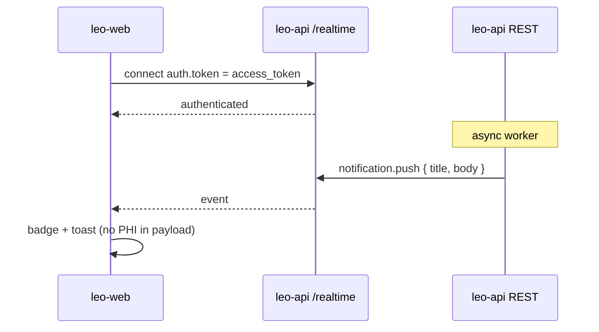

# P1-5 — Platform admin & security hardening

**Status:** draft · **Phase:** P1-5 · **Owner:** leo-web · **Deferred** → next phase (tenants/audit API; catalog/WSS/CSP ship then)

## Summary

Close the **P1 umbrella**: platform operator CRUD on global catalog, tenant browser, audit log viewer, WSS notification center in AdminShell header, CSP/HSTS middleware, and graceful 429 handling — completing `docs/ARCHITECTURE.md` §17 P1 checklist.

## User-facing behaviour

- **`/admin/platform`:** nav to Languages, Certifications, Tiers, Tenants, Audit.
- **Catalog CRUD:** three resource sections using shared table+form pattern; languages link to `tier_id` (UUID string); `is_signed` boolean; mutations refresh TanStack Query cache.
- **Tenant browser:** read-only list + detail (`/admin/platform/tenants/[id]`); no force-status in P1.
- **Audit log:** filterable table (date range, actor, action); paginated if API returns cursor/offset; no PHI in cells (INV-PHI-1).
- **Notifications:** bell in AdminShell header; badge count; panel lists recent `notification.push` events (title/body non-PHI); click marks read if API supports. Connects on auth, disconnects on logout.
- **429:** API errors with `Retry-After` header show toast with countdown; retry button re-issues request.

## Acceptance criteria

1. `platform_admin` can create/edit languages, certifications, language-tiers via catalog endpoints.
2. Tenant browser lists orgs and shows detail drill-down.
3. Audit viewer loads with at least actor + action filters.
4. WSS connects with access token; receives `notification.push`; disconnects on sign-out.
5. Response headers include CSP, HSTS, `X-Content-Type-Options`, `X-Frame-Options`, `Referrer-Policy`, **`Permissions-Policy`** on document responses.
6. Manual E2E: bootstrap admin → create catalog language → audit row visible.
7. P1 §17 checklist fully green; `npm run build` and `npm run lint` pass.

## Sequence diagram

## Component design

**`lib/wss/client.ts`:** socket.io-client to **same-origin** `/realtime` (Next.js rewrite/proxy to leo-api WSS — INV-WEB-WSS-1); handshake `{ auth: { token: accessToken } }`; `notification.push` handler; reconnect with backoff; tear down on `clearSession()`.

**Wire contract — catalog (exists):** e.g. `POST /catalog/languages` body `{ code, name, is_signed, is_active?, tier_id }` all snake_case; money N/A; IDs UUID strings. Tiers: `POST /catalog/language-tiers`, `PATCH /catalog/language-tiers/:id`.

**Wire contract — tenants/audit (arch-reference):** `GET /platform/tenants`, `GET /platform/tenants/:id`, `GET /audit/logs?...` — **verify leo-api handlers**; spec UI against OpenAPI when landed.

**Middleware** (`middleware.ts`): generate nonce per request; CSP `strict-dynamic` + nonce on scripts; HSTS `max-age=31536000; includeSubDomains` in production; **`Permissions-Policy`** per arch §13 / product §10.

**429 handling:** extend `ApiError` with `retryAfter?: number` from `Retry-After` header (integer seconds); UI only — no automatic retry loop.

## Non-goals

- Platform fee floor (P2); break-glass force-status; reports/export (P4); Playwright.

## Touches

INV-WEB-API-1/2/3; platform INV-PHI-1, INV-AUDIT-1; INV-WEB-WSS-1; INV-WEB-SECURITY-1 (arch §13 — CSP, HSTS, Permissions-Policy).

## Depends on

- P1-2 AdminShell (mount notification center in header).
- leo-api catalog (**exists**); tenant/audit endpoints (**leo-api slice**); WSS gateway (**exists**); Next `/realtime` proxy in `next.config.ts`.

## Approach

1. Platform routes + catalog CRUD pages.
2. Tenant + audit read-only views.
3. `lib/wss` + `NotificationCenter` component.
4. `middleware.ts` security headers + nonce plumbing in root layout.
5. `ApiError` 429 UX.

## Prerequisites (confirmed in leo-api)

- WSS handshake: Bearer via `auth.token` or `Authorization` header (`notification.gateway.ts`).
