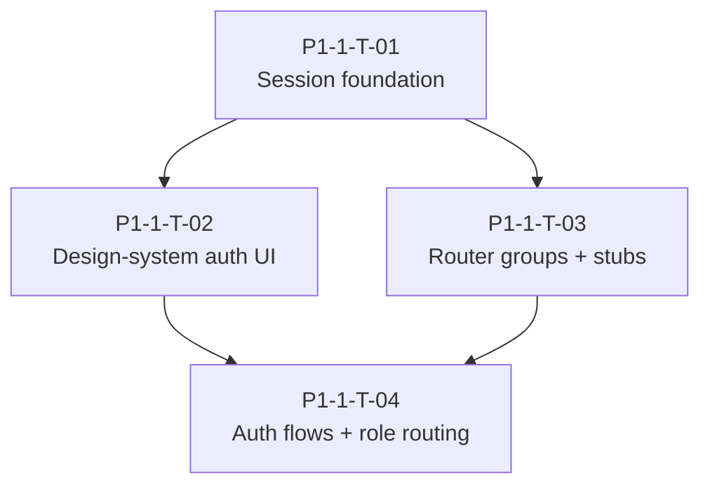

# P1-1 Taskgraph — Session hardening & auth foundation

> **Status: approved — ready for dispatch.**

| Field | Value |
| ----- | ----- |
| **Phase** | P1-1 |
| **Parent issue** | [#1](https://github.com/saambaby/leo-web/issues/1) |
| **Feature spec** | `.pineapple/features/p1-1-session-auth-foundation.md` |
| **Epic doc** | `.pineapple/phases/P1-1.md` |
| **Created** | 2026-07-07 |
| **Tasks** | 4 |
| **Waves** | 3 |

## Integration contract (owned by P1-1-T-01 — merge before fan-out)

| Field | Value |
| ----- | ----- |
| Web port | `:8080` |
| API proxy | `/api/v1/*` → `API_URL` (default `http://localhost:3000`) |
| Wire format | snake_case JSON |
| Refresh | httpOnly cookie `leo_refresh` via BFF only |
| Access | in-memory via `AuthProvider` |
| CSRF | `GET /api/auth/csrf` → `leo_csrf` cookie; `X-CSRF-Token` on BFF POSTs |
| Auth header | `Authorization: Bearer` on non-public API paths |

## DAG

**Parallel dispatch:** After T01 merges, **T02** and **T03** may run concurrently (`design-system` ↔ `shell`/`admin`/`portal` per code-map).

## Wave W1 — Foundation (gate: manual)

| ID | Title | Area | Model | Depends on | Verification |
| -- | ----- | ---- | ----- | ---------- | ------------ |
| **P1-1-T-01** | BFF session layer, AuthProvider, api interceptor, TanStack Query | foundation | high | — | auto + manual |

### P1-1-T-01 — BFF session layer, AuthProvider, api interceptor, TanStack Query

**Surface:** full-stack · **Spec:** `p1-1-session-auth-foundation.md`

**Acceptance criteria**

- `app/api/auth/session`, `refresh`, `logout`, `csrf` route handlers proxy leo-api; `leo_refresh` httpOnly cookie set/cleared server-side only.
- CSRF: readable `leo_csrf` cookie; mutating BFF POSTs require matching `X-CSRF-Token`.
- `AuthProvider` holds `access_token` in memory; exposes `setSession`, `clearSession`, `decodeClaims`.
- `lib/api.ts` attaches Bearer on non-public paths; silent refresh once on 401 via BFF; session-expired overlay → `/login` on second failure.
- `QueryClientProvider` in root layout; `@tanstack/react-query` added to dependencies.
- `lib/session.ts` token persistence removed (MFA enrollment pending → in-memory context).
- DevTools: no `access_token`/`refresh_token` in `sessionStorage`/`localStorage`.
- `npm run build` and `npm run lint` pass.

**Notes:** Single-writer for auth contract. Retires ADR-WEB-001. BFF ↔ browser JSON snake_case; refresh never echoed to client JS.

---

## Wave W2 — Structure & UI (gate: manual; parallel after W1)

| ID | Title | Area | Model | Depends on | Verification |
| -- | ----- | ---- | ----- | ---------- | ------------ |
| **P1-1-T-02** | Design-system primitives + `.theme-auth` AuthShell migration | design-system, auth-ui | standard | P1-1-T-01 | auto + manual |
| **P1-1-T-03** | App Router groups, protected stubs, WorkstationCta | shell, admin, portal | standard | P1-1-T-01 | auto |

### P1-1-T-02 — Design-system primitives + `.theme-auth` AuthShell migration

**Surface:** frontend

**Acceptance criteria**

- `components/design-system/` exports `Input`, `Button`, `Checkbox`, `Alert`, `Label` using token classes.
- `AuthShell` uses `.theme-auth` + `black-*` tokens; no hardcoded `#0b0d12` canvas.
- All existing public auth routes (`signup`, `login`, `verify-email`, `forgot-password`, `reset-password`, `mfa/enroll`) render with design-system primitives.
- `npm run build` and `npm run lint` pass.

**Notes:** Visual/structural only — do not rewire session logic (T04). Safe-parallel with T03 per code-map.

### P1-1-T-03 — App Router groups, protected stubs, WorkstationCta

**Surface:** frontend

**Acceptance criteria**

- Route groups: `(public)`, `(platform)`, `(lsp)`, `(portal)`, `(account)`; public auth pages under `(public)`.
- Stub protected pages: `/admin/platform`, `/admin/lsp`, `/portal/org`, `/portal/call`, `/account`.
- Each protected group layout has minimal client guard via `useAuth()` → redirect `/login` when unauthenticated.
- `WorkstationCta` component: native open/install copy; optional `leoconnexio://`; no `WORKSTATION_URL`.
- `app/dashboard/**` removed; no `/dashboard` route.
- `npm run build` and `npm run lint` pass.

**Notes:** Full MFA completion guard deferred to P1-2 (INV-WEB-AUTH-5). Stubs only — no org/user CRUD.

---

## Wave W3 — Flow wiring (gate: manual)

| ID | Title | Area | Model | Depends on | Verification |
| -- | ----- | ---- | ----- | ---------- | ------------ |
| **P1-1-T-04** | Auth flows, role routing, invite/setup/mfa routes | auth-ui, foundation | high | P1-1-T-01, P1-1-T-02, P1-1-T-03 | auto + manual |

### P1-1-T-04 — Auth flows, role routing, invite/setup/mfa routes

**Surface:** full-stack

**Acceptance criteria**

- `lib/auth-routing.ts` maps JWT `role` → home per product spec §4; missing `tenant_id` → `/account`.
- Login: inline TOTP on `mfa_required`; success calls `setSession` + `routeAfterLogin`.
- `/mfa` page: TOTP form with `?returnTo=`; does not break inline login path.
- `/invite/accept?token=`: `POST /invitations/accept` → redirect `/login?invited=1`; **no** `setSession`.
- `/admin/setup?token=`: reset password → MFA enroll → `/admin/platform` stub.
- MFA enrollment pending in AuthProvider memory (not sessionStorage).
- Update `.pineapple/invariants.md`: promote INV-WEB-AUTH-1/2/3, INV-WEB-ROUTE-2/3/4, INV-WEB-MFA-1, INV-WEB-UI-2 to as-built where applicable.
- `npm run build` and `npm run lint` pass.

**Manual verification (operator)**

- Signup (personal, business+customer, business+lsp) → verify → login → correct stub home.
- Invite accept → `/login?invited=1` (no session mint).
- `/admin/setup?token=` → MFA enroll → platform stub.
- Tenant-less interpreter → `/account` + WorkstationCta.
- `customer_user` → `/portal/call` stub + WorkstationCta.
- Auth pages visual check vs `leo-workstation.html` reference.

---

## Sanity check

| Check | Result |
| ----- | ------ |
| DAG acyclic | ✓ T01 → {T02,T03} → T04 |
| Independent branches | ✓ T02 ∥ T03 after T01 |
| Dependency hub risk | T01 is sole hub (expected) |
| Invariant violations | None — INV-WEB-AUTH-4/5 explicitly P1-2; INV-WEB-TENANT-1 P1-2 |
| safeParallelWith | T02 ∥ T03 permitted (design-system isolated from shell/admin/portal) |
| Platform edits | None — all tasks leo-web only |
| Integration contract owner | P1-1-T-01 before W2 fan-out |
| Phase size | 4 tasks / 3 waves — reviewable in one sitting |

## Reviewer notes

- **TanStack Query** lands in T01 so protected stubs in T03 can use hooks immediately; no data fetching required in stubs.
- **Switch-tenant** and **permission gate** are explicitly out of scope (P1-2).
- **Protected MFA enforcement** for privileged roles is stub-level guard only in P1-1; production guard ships P1-2.
- Approve this graph, then run **`/pineapple:orchestrate P1-1`**.
