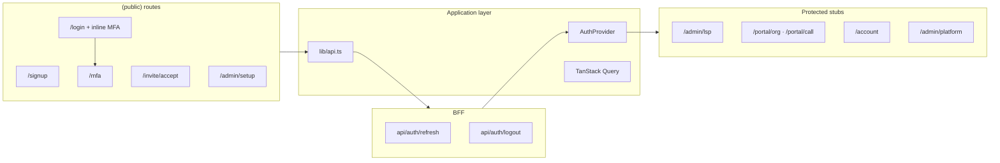

# Epic P1-1 — Session hardening & auth foundation

> **Parent:** `P1.md` · **Status:** **next** (active) · **Depends on:** shipped auth floor · **Blocks:** P1-2+

## Purpose

Replace the `sessionStorage` token spike with target session architecture, migrate auth UI to the design system, restructure App Router into layout groups, and wire post-login role routing — proving the riskiest assumption: **authenticated API calls work end-to-end** before any admin surface ships.

## In-scope

1. **BFF route handlers** — `app/api/auth/session`, `refresh`, `logout`, `GET csrf` proxy/bind leo-api; set/clear httpOnly `Secure` `SameSite` refresh cookie; CSRF token on mutations
2. **`AuthProvider`** — in-memory access token; `POST /auth/logout` via BFF on sign-out; retire `lib/session.ts` `sessionStorage` persistence
3. **`lib/api.ts` interceptor** — Bearer injection, silent refresh once on 401, session-expired overlay → `/login`
4. **TanStack Query** — provider in root layout; query client for future admin fetches
5. **Design system primitives** — `Input`, `Button`, `Checkbox`, `Alert`, `Label`; migrate all public auth pages to `.theme-auth` + reference mock alignment
6. **App Router restructure** — `(public)`, `(platform)`, `(lsp)`, `(portal)`, `(account)` layout groups with **stub** protected pages
7. **Post-login routing** — role table per product spec §4; remove `/dashboard`
8. **Hybrid MFA** — keep inline on `/login`; add `/mfa` for switch-tenant deep links; `/mfa/enroll` unchanged
9. **`/invite/accept`** — `POST /invitations/accept`; redirect `/login?invited=1` (no auto-login)
10. **`/admin/setup`** — Platform Admin CLI bootstrap funnel
11. **Role homes (stubs)** — `/account` (tenant-less interpreter + workstation CTA), `/portal/call` stub (customer_user + workstation CTA)

## Out-of-scope

- Switch-tenant modal (P1-2)
- Permission matrix gate (P1-2)
- Light admin shell chrome / data tables (P1-2, P1-3+)
- Any `GET/PATCH /organizations/me` or user CRUD (P1-3, P1-4)
- Platform catalog, tenant browser, audit (P1-5)
- WSS notification center (P1-5)
- CSP / HSTS middleware (P1-5)
- Consent re-acceptance modal (P1-2)
- LSP onboarding wizard (P2)

## Success criteria / Done-when

- [ ] Refresh token visible only in httpOnly cookie (DevTools audit — not in `sessionStorage`/`localStorage`)
- [ ] Access token held in memory only via `AuthProvider`
- [ ] `npm run build` and `npm run lint` pass
- [ ] Manual E2E: signup (all 3 union variants) → verify → login → correct role stub home
- [ ] Manual E2E: invite accept → `/login?invited=1` (no session mint)
- [ ] Manual E2E: `/admin/setup?token=` → reset password → MFA enroll → `/admin/platform` stub
- [ ] Manual E2E: tenant-less interpreter lands `/account` with workstation CTA
- [ ] Manual E2E: `customer_user` lands `/portal/call` stub with workstation CTA
- [ ] Auth pages visually reviewed against `leo-workstation.html` reference
- [ ] ADR-WEB-001 retired; invariants updated

## Strict-subset architecture

## API prerequisites (verify before start)

| Scenario | leo-api behaviour needed |
| -------- | ------------------------ |
| Tenant-less interpreter login | JWT minted with no `tenant_id`; login does not throw |
| Multi-membership | JWT scoped to most recent active membership |
| Invite accept | Returns `{ user_id, tenant_id, role, membership_id }` only → web redirects `/login?invited=1` |

## Integration contract

| Field | Value |
| ----- | ----- |
| Auth (target) | in-memory access + httpOnly refresh via BFF |
| Public endpoints | all `/auth/*` + `/invitations/accept` |
| Authenticated calls | Bearer on any protected stub `GET` smoke test |
