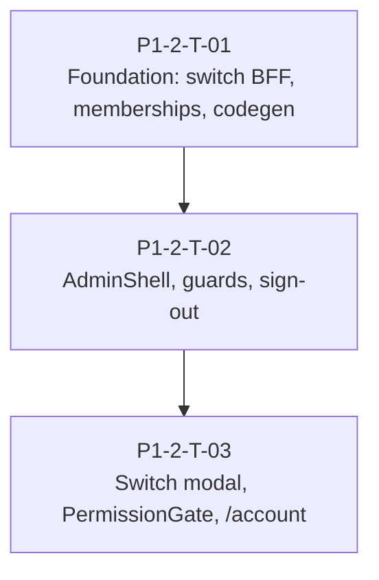

# P1-2 Taskgraph — Protected shell & shared chrome

> **Status: completed — all tasks merged to main (PRs #14–#16). Closes P1 spine.**

| Field | Value |
| ----- | ----- |
| **Phase** | P1-2 |
| **Feature spec** | `.pineapple/features/p1-2-protected-shell.md` |
| **Epic doc** | `.pineapple/phases/P1-2.md` |
| **Created** | 2026-07-08 |
| **Tasks** | 3 |
| **Waves** | 3 |
| **Closes** | P1 spine (with P1-1) |

## Integration contract (owned by P1-2-T-01 — merge before fan-out)

Inherited from P1-1 (ports `:8080`→`:3000`, snake_case, httpOnly `leo_refresh`, in-memory access, CSRF on BFF POSTs). **P1-2 extensions:**

| Field | Value |
| ----- | ----- |
| `GET /memberships` | Bearer; active rows only; nested `organization: { id, name, type }` |
| `POST /api/auth/switch-tenant` | BFF body `{ tenant_id, totp_code? }`; server attaches `refresh_token` from cookie; response `{ access_token, expires_in }` or `{ mfa_required: true }` |
| `localStorage` | `leo.last_tenant_id` (UUID) — preference only, not secrets |
| Permission codegen | `npm run codegen:permissions` → `lib/permissions/generated.ts` from leo-api matrix |

## DAG

**No parallel dispatch** — T02 and T03 both own `AdminShell` integration; sequential merge avoids header/nav conflicts.

## Wave W1 — Foundation (gate: manual)

| ID | Title | Area | Model | Depends on | Verification |
| -- | ----- | ---- | ----- | ---------- | ------------ |
| **P1-2-T-01** | Switch-tenant BFF, memberships hook, permission codegen, last_tenant_id | foundation | high | — | auto |

### P1-2-T-01 — Switch-tenant BFF, memberships hook, permission codegen, last_tenant_id

**Surface:** full-stack · **Spec:** `p1-2-protected-shell.md`

**Acceptance criteria**

- `POST /api/auth/switch-tenant` BFF proxies leo-api; CSRF-protected; `refresh_token` from `leo_refresh` cookie server-side; never echoed to client JS.
- BFF handles `{ mfa_required: true }` response without setting session.
- `useMemberships()` TanStack Query hook fetches `GET /memberships`; types match `MembershipResponseDto` + nested `organization`.
- `npm run codegen:permissions` generates `lib/permissions/generated.ts` from leo-api `permission-matrix.ts`; `hasPermission(role, permission)` exported.
- `PermissionGate` component: default deny → empty state (not 403 page).
- `leo.last_tenant_id` persisted to `localStorage` on `setSession` and successful switch; on login, auto-switch when stored id ≠ JWT `tenant_id` and appears in memberships.
- `npm run build` and `npm run lint` pass.

**Notes:** Single-writer for P1-2 integration contract. Foundation task — coordinator branch on `main`, no worktree.

---

## Wave W2 — Admin shell (gate: manual)

| ID | Title | Area | Model | Depends on | Verification |
| -- | ----- | ---- | ----- | ---------- | ------------ |
| **P1-2-T-02** | AdminShell, session/MFA guards, sign-out | shell | high | P1-2-T-01 | auto + manual |

### P1-2-T-02 — AdminShell, session/MFA guards, sign-out

**Surface:** frontend

**Acceptance criteria**

- `ProtectedGuard` replaced/upgraded: unauthenticated → `/login?returnTo=<path>`; privileged roles (`platform_admin`, `lsp_admin`, `sub_admin`) without MFA satisfied → `/mfa/enroll`.
- `AdminShell` component: light `bg-canvas` / `bg-surface` layout; header + sidebar; role-aware nav links; active org name placeholder; sign-out action.
- All protected layout groups `(platform)`, `(lsp)`, `(portal)`, `(account)` wrap children in `AdminShell`.
- Sign-out: header action → `POST /api/auth/logout` BFF → clear `AuthProvider` → redirect `/login` (INV-WEB-AUTH-4).
- Loading/empty states use design-system tokens (no hardcoded `#0b0d12` in guards).
- `npm run build` and `npm run lint` pass.

**Notes:** Nav links rendered without `PermissionGate` yet (T03). Switch-tenant header slot stubbed empty.

---

## Wave W3 — Tenant switch & account (gate: manual)

| ID | Title | Area | Model | Depends on | Verification |
| -- | ----- | ---- | ----- | ---------- | ------------ |
| **P1-2-T-03** | Switch-tenant modal, PermissionGate nav, /account security | shell, portal | high | P1-2-T-01, P1-2-T-02 | auto + manual |

### P1-2-T-03 — Switch-tenant modal, PermissionGate nav, /account security

**Surface:** full-stack

**Acceptance criteria**

- Switch-tenant control visible in `AdminShell` header when `memberships.length > 1` (not JWT inference).
- Modal lists `organization.name`, `organization.type`, `role` per row; full-row button (min-height 44px); hover highlight.
- Selecting org calls BFF switch-tenant; success → `setSession` + `routeAfterLogin`; `mfa_required` → `/mfa?returnTo=<current path>`.
- `PermissionGate` applied to AdminShell nav links; cross-role paths hidden/denied (e.g. `customer_user` cannot see LSP nav).
- `/account` page: password shortcut, MFA status/enroll link, interpreter awaiting-affiliation empty state + `WorkstationCta` when JWT lacks `tenant_id`.
- Update `.pineapple/invariants.md`: promote INV-WEB-AUTH-4/5, INV-WEB-TENANT-1, INV-WEB-PERM-1 to as-built.
- `npm run build` and `npm run lint` pass.

**Manual verification (operator)**

- Unauthenticated `/admin/platform` → `/login` with `returnTo`.
- Privileged user without MFA → `/mfa/enroll`.
- User with 2+ memberships: switch succeeds; MFA path returns to `returnTo`.
- Sign-out revokes refresh server-side (cookie cleared).
- Tenant-less interpreter sees awaiting-affiliation on `/account`.

---

## Sanity check

| Check | Result |
| ----- | ------ |
| DAG acyclic | ✓ T01 → T02 → T03 |
| Independent branches | None — sequential by design (AdminShell single-writer) |
| Dependency hub risk | T01 foundation hub (expected) |
| Invariant violations | None — INV-WEB-CONSENT-1 explicitly deferred |
| safeParallelWith | No concurrent pairs (AdminShell conflict) |
| Platform edits | None — leo-web only; `GET /memberships` shipped |
| Integration contract owner | P1-2-T-01 before W2 |
| Phase size | 3 tasks / 3 waves — reviewable in one sitting |

## Reviewer notes

- **Consent modal** deferred to next phase (no stub).
- **Notification center / WSS** deferred to P1-5.
- **Org/user CRUD pages** deferred to P1-3/P1-4.
- T02 MFA guard may use JWT claims + enrollment state; exact MFA-satisfied signal should match leo-api refresh-family semantics.
- Approve this graph, then run **`/pineapple:orchestrate P1-2`**.
