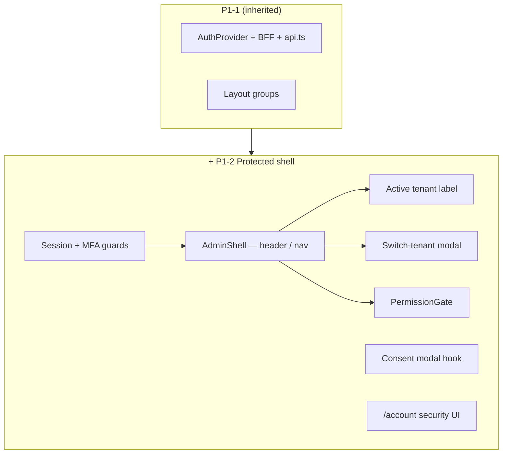

# Epic P1-2 — Protected shell & shared chrome

> **Status:** planned · **Parent:** `P1.md` · **Depends on:** P1-1 · **Closes:** P1 spine (with P1-1)

## Purpose

Turn layout-group stubs into real **protected shells** — session/MFA guards, light admin chrome, switch-tenant, and client-side permission mirroring — so tenant-scoped feature pages plug into a consistent frame.

## In-scope

1. **Protected layout guards** — validate session via `AuthProvider`; redirect unauthenticated → `/login`; enforce MFA for privileged roles (`platform_admin`, `lsp_admin`, `sub_admin`)
2. **Admin shell (light theme)** — `bg-canvas` / `bg-surface` header + sidebar pattern per design-system README; shared across `/admin/*`, `/portal/*`, `/account/*`
3. **Active tenant label** — display org name from JWT / `GET /organizations/me` summary
4. **Switch-tenant modal** — `GET /memberships` (self, active, nested `organization`); `POST /auth/switch-tenant` via BFF; MFA redirect to `/mfa?returnTo=` when required
5. **Permission gate** — build-time codegen from leo-api `permission-matrix.ts` → `lib/permissions/generated.ts`
6. **`last_tenant_id`** — `localStorage` `leo.last_tenant_id`; auto `switch-tenant` on login when held
7. **`/account/*` security UI** — password shortcut, MFA management, awaiting-affiliation empty state + `WorkstationCta`
8. **Sign-out** — full flow: BFF logout + clear `AuthProvider` + redirect `/login`

## Out-of-scope

- LSP org profile / user CRUD pages (P1-3 — next phase)
- Customer org settings / members (P1-4 — next phase)
- Platform catalog / tenant browser / audit / WSS / CSP (P1-5 — next phase)
- Consent re-acceptance modal (next phase — needs `GET /consent/status`)
- Data tables with real API data (P1-3+)

## Success criteria / Done-when

- [ ] Unauthenticated access to any `/admin/*`, `/portal/*`, `/account/*` redirects to `/login`
- [ ] Privileged role without MFA completed redirects to `/mfa/enroll`
- [ ] User with 2+ memberships sees switch-tenant in header; switch succeeds; MFA path works
- [ ] Permission gate hides/disables actions per role on stub pages
- [ ] `/account` shows security settings + interpreter awaiting-affiliation state
- [ ] Sign-out revokes refresh family server-side and clears client state

## Strict-subset architecture

