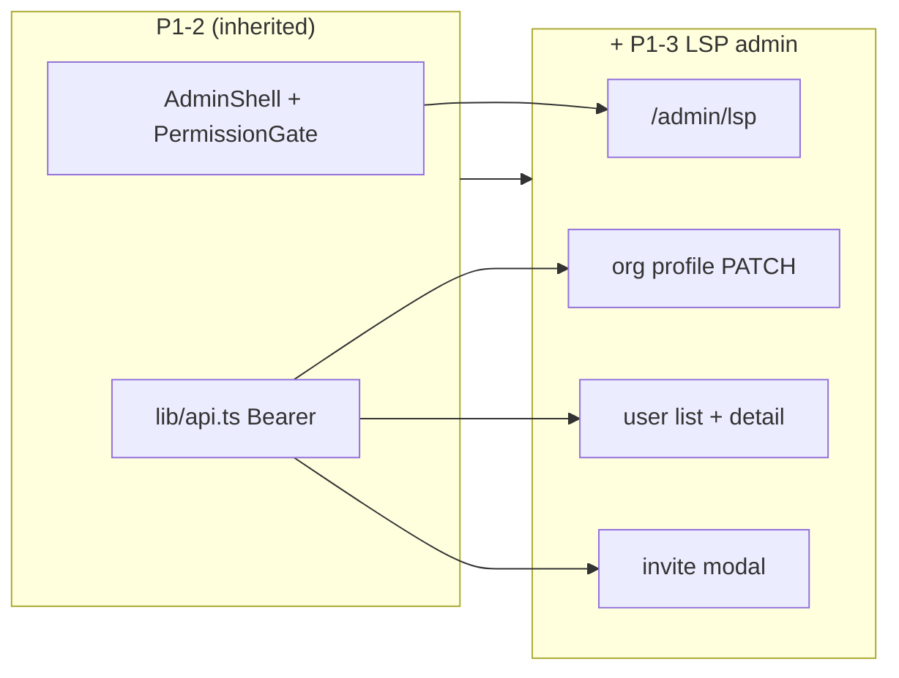

# Epic P1-3 — LSP admin surfaces

> **Status:** **deferred** → next phase · **Parent:** `P1.md` · **Depends on:** P1-2 + leo-api `GET/POST /users`

## Purpose

Ship the **LSP back-office** P1 surfaces at full arch depth — org profile and user management — integrated via Bearer-authenticated API calls inside the protected LSP shell.

## In-scope

1. **`/admin/lsp` home** — dashboard stub with nav to org + users
2. **Org profile** — `GET/PATCH /organizations/me`; `name`, `timezone`, `business_hours` only (current DTO); inline validation + unsaved-changes guard
3. **User list** — sticky-header data table; role/status filters; TanStack Query cache
4. **Invite user modal** — `POST /invitations`; sub_admin and other LSP-invitable roles per API
5. **User detail** — view/edit profile fields; toggle active; trigger reset password; delete with confirm modal

## Out-of-scope

- LSP onboarding wizard — partners, languages, pricing (P2)
- Interpreter list, affiliation queue, cert review (P2)
- Rate cards, billing (P2)
- Customer portal surfaces (P1-4)
- Platform admin (P1-5)
- WSS-driven live updates on user list (P1-5 notification center is separate)

## Success criteria / Done-when

- [ ] `lsp_admin` can view and PATCH org profile; changes persist on reload
- [ ] User list loads from API; filters work client-side or via query params per API contract
- [ ] Invite flow sends invitation; success/error states handled via `ApiError`
- [ ] User detail CRUD operations work; destructive actions require confirm modal
- [ ] `sub_admin` read-only access to `/admin/lsp/*`; non-LSP roles (`customer_*`, `interpreter`) blocked (gate + API 404)
- [ ] Manual E2E: LSP signup → verify → login → org profile → invite user

## Strict-subset architecture

