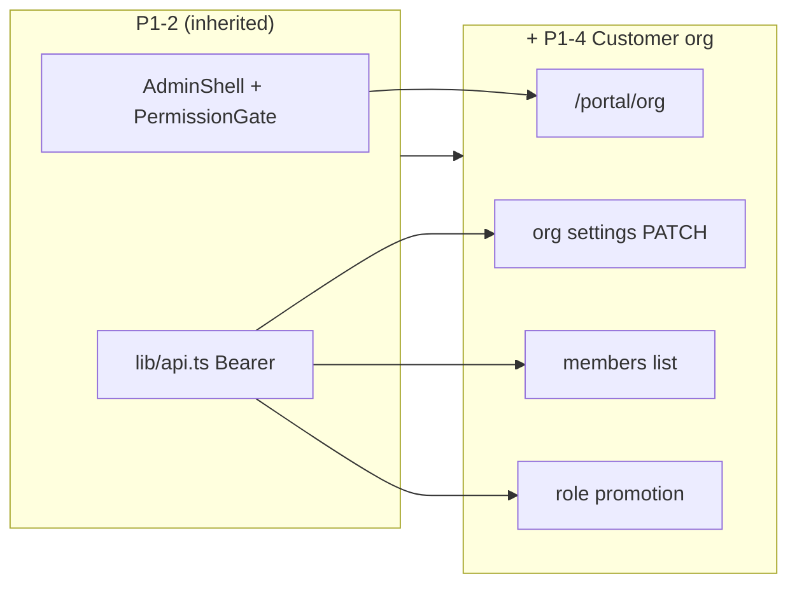

# Epic P1-4 — Customer portal org

> **Status:** **deferred** → next phase · **Parent:** `P1.md` · **Depends on:** P1-2 + leo-api `GET/POST /users`

## Purpose

Ship the **customer org admin** P1 surfaces — org settings and member management with role promotion — web-first home for `customer_admin` per BD7.

## In-scope

1. **`/portal/org` home** — nav to settings + members; placeholder for P3 call link
2. **Org settings** — `GET/PATCH /organizations/me`; `name`, `timezone`, `business_hours` only (current DTO)
3. **Members list** — table of org members with role chips
4. **Invite member** — `POST /invitations` for `customer_user` (and roles API allows)
5. **Role promotion UI** — promote member in place (e.g. `customer_user` → elevated role per alpha.5 API)

## Out-of-scope

- Desktop call portal `/portal/call/new` (P3) — stub from P1-1 remains for `customer_user`
- Billing fields config (P3)
- Customer billing / reports (P4)
- LSP admin (P1-3)
- Platform admin (P1-5)
- LSP ↔ customer link management (P3)

## Success criteria / Done-when

- [ ] `customer_admin` can view and PATCH customer org settings
- [ ] Members list loads; invite sends successfully
- [ ] Role promotion works per API contract; UI reflects new role
- [ ] `customer_user` cannot access `/portal/org/settings` or members admin actions (gate + API)
- [ ] Manual E2E: customer business signup → verify → login → org settings → invite requester

## Strict-subset architecture

