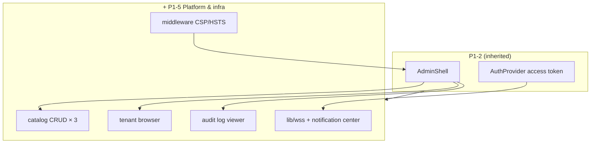

# Epic P1-5 — Platform admin & security hardening

> **Status:** **deferred** → next phase · **Parent:** `P1.md` · **Depends on:** P1-2 + leo-api tenants/audit endpoints

## Purpose

Ship **platform operator** tools and cross-cutting infra — catalog CRUD, tenant browser, audit viewer, realtime notification center, and security headers — completing the `docs/ARCHITECTURE.md` §17 P1 checklist.

## In-scope

1. **`/admin/platform` home** — nav to catalog, tenants, audit
2. **Catalog — languages** — full CRUD per platform API
3. **Catalog — certifications** — full CRUD
4. **Catalog — tiers** — full CRUD
5. **Tenant browser** — list platform tenants; read-only detail view
6. **Audit log viewer** — filterable table (actor, action, date range per API)
7. **WSS notification center** — lightweight client in `lib/wss/`; authenticate on handshake with access token; subscribe `notification.push`; mount in protected shell header
8. **CSP / HSTS middleware** — `strict-dynamic` + nonces, security headers per arch §13
9. **429 graceful UX** — `Retry-After` handling in `lib/api.ts`

## Out-of-scope

- Platform fee floor editor (P2)
- Break-glass force-status actions (later)
- Full reporting / export (P4)
- Vonage/Twilio media (P3)
- Playwright e2e suite (unless explicitly requested)
- Permission matrix build-time codegen (moved to P1-2)

## Success criteria / Done-when

- [ ] `platform_admin` can CRUD languages, certifications, tiers
- [ ] Tenant browser lists tenants with detail drill-down
- [ ] Audit log loads with filters; pagination if API supports
- [ ] WSS connects on login; disconnects on logout; shows at least one notification toast/badge
- [ ] Security headers present on production build (verify via `curl -I` or browser network)
- [ ] Manual E2E: CLI bootstrap admin → catalog create → audit entry visible
- [ ] **P1 umbrella closes** — all §17 P1 checklist rows green

## Strict-subset architecture

## WSS prerequisite

Confirm leo-api `/realtime` handshake accepts Bearer access token (open question in product spec §5) before implementation.
