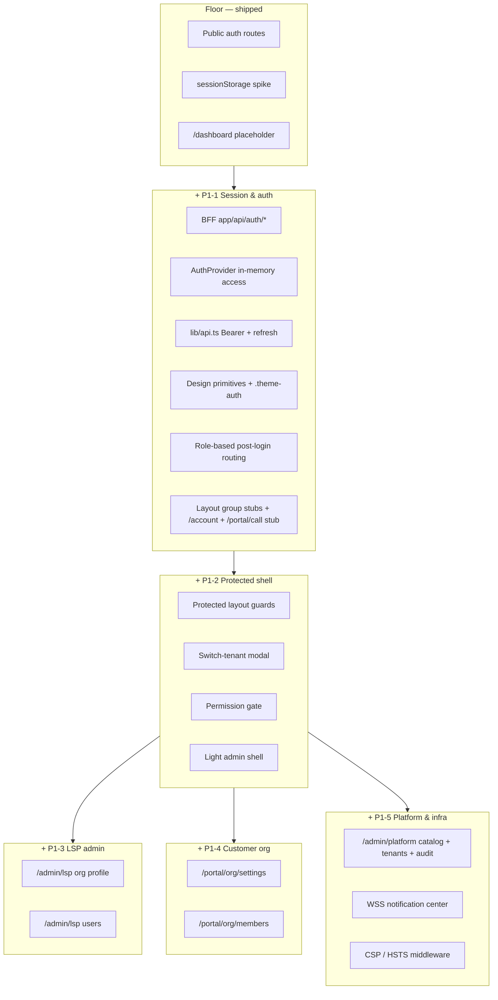

# Phase P1 — Platform spine (umbrella)

> **Status:** active · **Product spec:** `.pineapple/product-spec.md` (2026-07-07 interview) · **Target:** `docs/ARCHITECTURE.md` §17 P1 checklist at full depth
> **Platform:** leo-api closed `v0.0.1-alpha.5`

## Purpose

Close **P1 spine** — auth hardening (P1-1) + protected shell with switch-tenant (P1-2). Admin surfaces (P1-3–P1-5) **deferred to next phase** pending leo-api slices (consent, users, platform tenants, audit). `GET /memberships` is **available** in leo-api.

## Four-question diagnostic (why split)

| Question | Answer | Evidence |
| -------- | ------ | -------- |
| Demo points | **Yes** | Session hardening demo → LSP admin demo → customer portal demo → platform admin demo — weeks apart |
| Load-bearing | **Yes** | httpOnly BFF + Bearer interceptor gates every authenticated surface; research flags tenant-less login as API prerequisite |
| Dependency clusters | **Yes** | Auth spine · shared chrome · LSP admin · customer org · platform admin — low cross-fan-out |
| Converged splits | **Yes** | Product spec §Capabilities already clusters 1–11; arch §5.2 layout groups map 1:1 |

**Decision:** split P1 into five epics. Do **not** ship admin grids before session hardening.

## Epic table

| Epic | Purpose | Status | Doc |
| ---- | ------- | ------ | --- |
| **Floor** | Public auth funnel (pre-carve) | **shipped** | §Shipped floor below |
| **P1-1** | Session hardening, auth UI, routing, layout stubs | **next** | `P1-1.md` |
| **P1-2** | Protected shell, switch-tenant, permissions, admin chrome | planned (closes P1 spine) | `P1-2.md` |
| P1-3 | LSP admin — org profile, users | **deferred** → next phase | `P1-3.md` |
| P1-4 | Customer portal org — settings, members | **deferred** → next phase | `P1-4.md` |
| P1-5 | Platform catalog, WSS, CSP; tenants/audit deferred | **deferred** → next phase | `P1-5.md` |

**This phase closes when P1-1 + P1-2 land.** P1-3–P1-5 resume after leo-api ships consent, users, platform tenants, and audit endpoints.

## Cumulative architecture (strict subset — grows monotonically)

## Shipped floor (do not regress)

| Item | Route / module |
| ---- | -------------- |
| Union signup | `/signup` |
| Signup success | `/signup/success` |
| Email verify | `/verify-email` |
| Login (inline MFA) | `/login` |
| MFA enroll | `/mfa/enroll` |
| Forgot / reset password | `/forgot-password`, `/reset-password` |
| API proxy | `next.config.ts` → `/api/v1/*` |

## P1 spine done-when

P1-1 + P1-2 complete. Full `docs/ARCHITECTURE.md` §17 admin surfaces (P1-3–P1-5) resume in **next phase** after leo-api endpoints land. **P2** LSP MVP sellable work follows admin surfaces.

## Research constraint

[[research/synthesis/leo-api]] — tenant-less interpreter login and multi-membership JWT resolution are **API prerequisites** for `/account` routing and switch-tenant. Verify leo-api alpha.5+ behaviour before closing P1-1.

## Related specs

- `../leo-api/.pineapple/specs/unified-signup-onboarding.md`
- `../leo-api/.pineapple/features/auth-identity-tokens.md`
